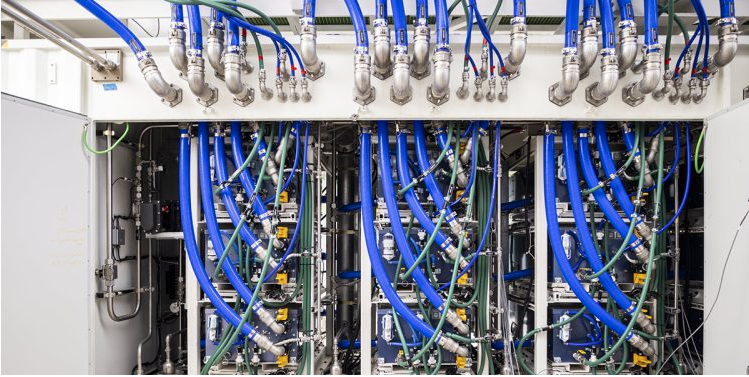
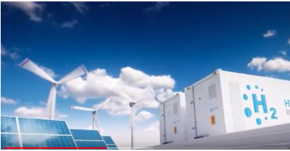
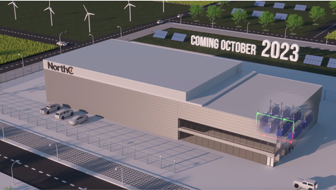

# Tecnología y sistemas: Uso en data centers para reducción de huella de carbono.

[El hidrógeno como alternativa verde para los data center](https://felipebenjumeallorente.com/el-hidrogeno-como-alternativa-verde-para-los-data-center/)

# Data Centers y Hidrógeno Verde
## ¿Existen Data Centers que funcionen completamente con hidrógeno?

- [ ] Sí
- [ ] No

## ¿Existen proyectos de Data Centers que funcionen con esta tecnología?

- [ ] Sí
- [ ] No

## ¿Sabes qué países son pioneros en data centers con hidrógeno verde?

## Países punteros

- [ ] Países Bajos
- [ ] Estados Unidos
- [ ] Francia
- [ ] Chile
- [ ] España

### Proyectos destacados

Actualmente, no hay data centers operativos que funcionen completamente con hidrógeno verde.
Sí existen varios proyectos en desarrollo y pruebas piloto que están explorando esta tecnología.

1. **Microsoft**
   - Ha realizado pruebas exitosas con un sistema de pilas de combustible de hidrógeno:
     - En 2022, lograron alimentar servidores durante 48 horas consecutivas con este sistema.
     - Planean instalar un sistema de pila de combustible de segunda generación en un centro de datos de investigación.

2. **Atos y HDF Energy**
   - Anunciaron un plan para construir un data center verde:
     - Este proyecto utilizará pilas de combustible de alta potencia alimentadas con hidrógeno verde.
     - Se espera que demuestren un primer centro de producción completo operado con hidrógeno verde en 2023.
       

3. **NorthC Datacenters y Innio**
   - Están desarrollando una solución de almacenamiento de energía de emergencia para un nuevo centro de datos en Eindhoven, Países Bajos.
   - El proyecto incluye:
     - Seis motores de hidrógeno Jenbacher que proporcionarán energía de reserva de emergencia libre de carbono.
     - Una potencia total de seis megavatios.
     - Se espera que esté operativo en el segundo semestre de 2023.

## CONCLUSIÓN:
Estos proyectos representan avances significativos hacia la implementación de hidrógeno verde en data centers, aunque aún están en fases de prueba o implementación inicial.

