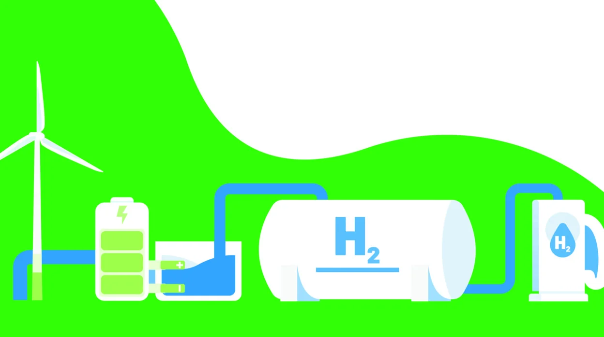

# Conclusión y Debate

---
## 🌱 ¿Es viable el hidrógeno verde en Andalucía? 🌍
Andalucía tiene un gran potencial para la producción de hidrógeno verde gracias a sus abundantes recursos de energía renovable, especialmente solar ☀️ y eólica 💨. La comunidad cuenta con un elevado número de horas de sol al año y un importante desarrollo de parques eólicos, lo que la posiciona como una región clave para la generación de electricidad renovable necesaria para la electrólisis del agua 💧.

Sin embargo, la viabilidad del hidrógeno verde en Andalucía enfrenta varios desafíos:
- **💰 Costes elevados**: La tecnología de electrólisis sigue siendo cara, lo que encarece la producción del hidrógeno verde en comparación con otros tipos de hidrógeno (gris o azul).
- **🏗️ Infraestructura insuficiente**: Se requieren importantes inversiones en plantas de electrólisis, redes de transporte y sistemas de almacenamiento para su despliegue a gran escala.
- **⚖️ Desafíos normativos y políticos**: La regulación en torno al hidrógeno verde aún está en desarrollo, lo que puede generar incertidumbre en los inversores.

A pesar de estos desafíos, el hidrógeno verde representa una oportunidad estratégica para Andalucía en términos de sostenibilidad 🌿, empleo 👷‍♂️ y independencia energética ⚡. Con inversiones adecuadas y apoyo gubernamental, puede convertirse en un pilar clave de la transición energética en la región.

## 🖥️ ¿Cómo pueden los futuros administradores de sistemas ayudar en la transición ecológica? 🌎
Los administradores de sistemas juegan un papel fundamental en la sostenibilidad al aplicar estrategias tecnológicas que optimizan el uso de los recursos y reducen el impacto ambiental 🌍. Algunas de sus contribuciones incluyen:

- **💾 Optimización de centros de datos**: Uso de virtualización y computación en la nube ☁️ para reducir el número de servidores físicos y, con ello, el consumo energético ⚡.
- **🔋 Eficiencia energética en redes y dispositivos**: Configuración de hardware en modo de bajo consumo y gestión eficiente del tráfico de datos mediante redes definidas por software (SDN).
- **♻️ Gestión responsable de residuos electrónicos**: Implementación de políticas de reciclaje y reutilización de equipos informáticos.
- **🔆 Uso de energías renovables en infraestructuras TI**: Integración de energía solar ☀️ y eólica 💨 en centros de datos para reducir la huella de carbono.
- **🏡 Fomento del teletrabajo y digitalización**: Reducción de desplazamientos físicos 🚗 y disminución de la huella de carbono 🌿.

En definitiva, la labor de los administradores de sistemas es clave para hacer que las tecnologías de la información sean más sostenibles y contribuyan activamente a la transición ecológica 🌍.

## 🤖 Reflexión sobre el impacto de la digitalización en la sostenibilidad 🌿
La digitalización tiene un impacto dual en la sostenibilidad:

### ✅ Aspectos positivos:
- **📄 Reducción del consumo de recursos físicos**: La digitalización de documentos y procesos disminuye el uso de papel y otros materiales.
- **⚡ Optimización de la eficiencia energética**: Tecnologías como la inteligencia artificial 🤖 y el análisis de datos 📊 pueden ayudar a reducir el consumo de energía en diferentes sectores.
- **🏡 Fomento del teletrabajo**: Disminuye los desplazamientos 🚗 y, por tanto, reduce la huella de carbono 🌱.
- **🏢 Gestión inteligente de infraestructuras**: Sensores IoT 📡 y automatización permiten optimizar el uso de la energía y mejorar la eficiencia de edificios y fábricas.

### ❌ Aspectos negativos:
- **⚡ Aumento del consumo energético de los centros de datos**: La creciente demanda de procesamiento y almacenamiento de datos incrementa el consumo eléctrico global ⚠️.
- **🖥️ Generación de residuos electrónicos**: La rápida obsolescencia de dispositivos tecnológicos contribuye a la acumulación de desechos electrónicos ♻️.
- **🌎 Dependencia de recursos no renovables**: La fabricación de dispositivos digitales requiere materiales como litio 🔋 y tierras raras, cuya extracción tiene impactos ambientales significativos.

Para maximizar los beneficios de la digitalización y minimizar sus impactos negativos, es fundamental adoptar enfoques de eficiencia energética ⚡, reciclaje de hardware ♻️ y fomento del uso de energías renovables ☀️ en el sector tecnológico.
